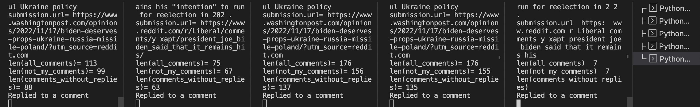

# Reddit Bot Project [Overview](https://github.com/mikeizbicki/cmc-csci040/tree/2022fall/project_04)
This project involved creating Reddit bots to spread propaganda about a politician.
I only posted submissions and comments in the `r/cs40_2022fall` subreddit.

###Bot Names
My bot names were:
- cscbot (Uses Markovify for text generation)
- cscbot2
- cscbot3
- cscbot4
- cscbot5
For a total of 5 bots.

Here's an image of all 5 running at the same time:

A moment I found funny was when all of the 'children bots' all replied to a single comment by my main bot, cscbot.
The original thread can be found [here](https://www.reddit.com/r/cs40_2022fall/comments/z6ehah/comment/iy10vx8/?utm_source=share&utm_medium=web2x&context=3)
And here's a screenshot of the thread:

Here are the final counts of the comments from each bot:

Here is the bit of code that makes it so the bots reply to the top upvoted comment:

First, we sort the comments by the "score" from highest to lowest.
Then, since the highest score will come first, we reply to that comment.

###Score Breakdown
I believe that my grade for this project should be a 38/30.
| (Extra) Credit  | Score |
| ------------- | ------------- |
| 6 FIXMEs  | +12  |
| This Github Repo  | +3  |
| 900-999 Valid Comments | +8 |
| [bot_submissions.py](https://github.com/chlol3912/reddit_bot/blob/main/bot_submissions.py) | +2 |
| Bot Army (see above) | +2 |
| Replies to Top Comment (see above) | +2 |
| [bot_vote.py with Textblob](https://github.com/chlol3912/reddit_bot/blob/main/bot_vote.py) | +4 |
| [Markovify](https://github.com/chlol3912/reddit_bot/blob/main/bot1/bot1.py)| +5 |
